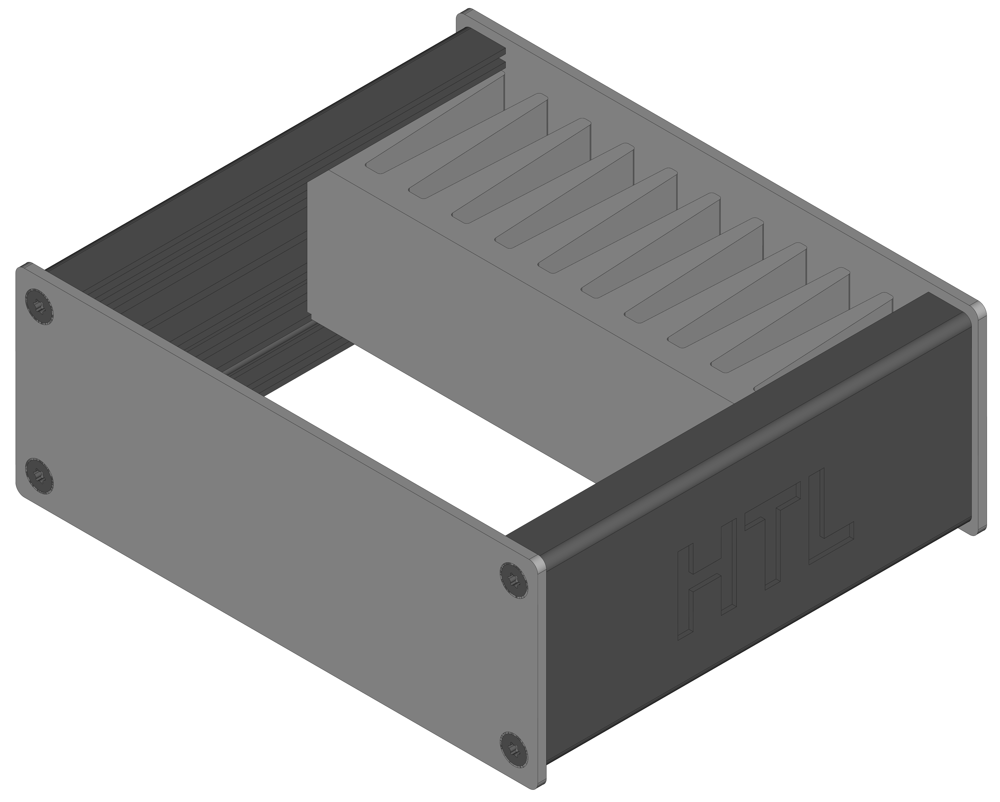
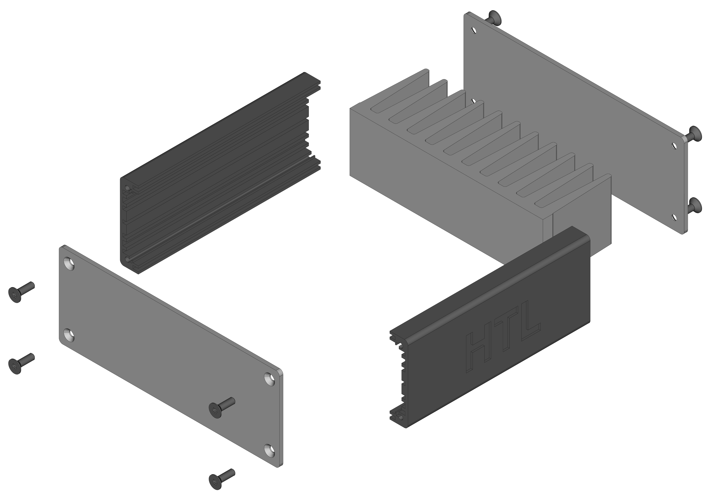
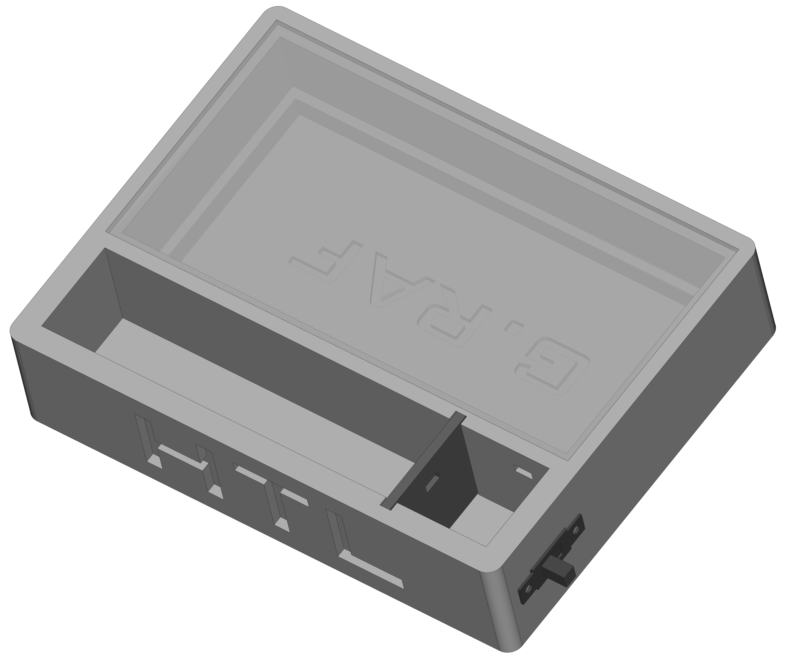
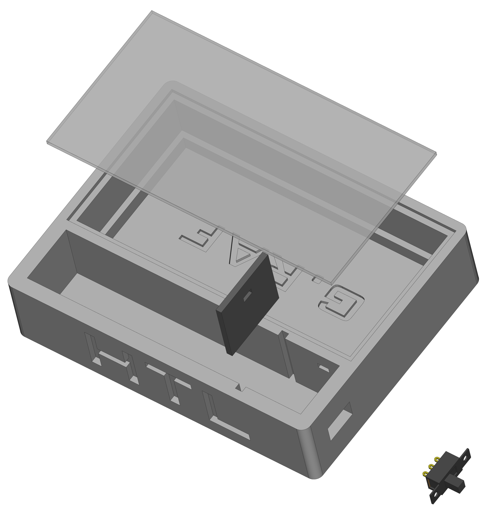

  

# FreeCAD test repository

## Downloads

| Type      | File               | Description              |
|:---------:|:------------------:|:-------------------------|
| Housing | [zip](https://github.com/0x007E/freecad/releases/latest/download/freecad-mechanical.zip) / [tar](https://github.com/0x007E/freecad/releases/latest/download/freecad-mechanical.tar.gz) | Mechanical housing files     |
| Housing | [zip](https://github.com/0x007E/freecad/releases/latest/download/freecad-printing.zip) / [tar](https://github.com/0x007E/freecad/releases/latest/download/freecad-printing.tar.gz) | Printing housing files     |

## Mechanical housing

The mechanical housing can be edited over a spreadsheet. It uses a 42mm side profile [(Datasheet)](https://gie-tec.de/wp-content/uploads/2017/03/db_122010.pdf). The project itself contains nececarry TechDraws of all used elements.

## Print housing

The print housing can be edited over a spreadsheet and can be printed with a 3D printer. The project itself contains nececarry TechDraws of all used elements.

---

> IMPORTANT: Third party devices (e.g. switches, batteries, ...) are mostly imported from [GrabCAD](https://grabcad.com/dashboard). Fonts are imported from [dafont](https://www.dafont.com/) or from Windows system (%WINDIR%\Fonts).

---

R. GAECHTER